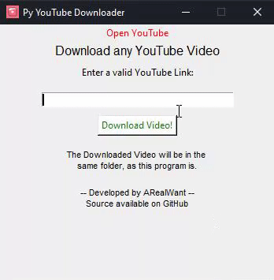

# Python-YouTube-Downloader
⏬ Download YouTube Videos with the Python YouTube Downloader, using Pytube, also already converted to an .exe file.
You can easily copy paste a link and the video will be downlaoded in a folder on your pc!

## Get Started [Source]
1. Download the Source Code by clicking on Releases > Python YouTube Downloader
2. Install the requirements.txt
3. Start the main.py

## Get Started [Exe]
1. Head over to the "Executable File" folder
2. Download the .zip file (YouTube Downloader.zip > Download)
3. Unzip the folder and start the .exe file in the resources folder

## The Screenshots

## Note
Downloading YouTube Videos is against the ToS of YouTube, so this repo is only for educational purposes.
Learn more: https://www.youtube.com/static?template=terms
